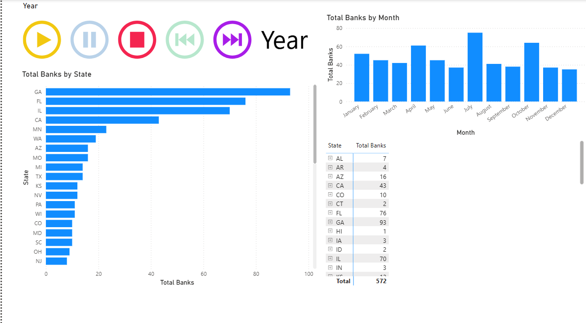

# Failed Bank Report
=======
# Failed Bank — Power BI Report

This repository contains a Power BI report analyzing **failed banks in the United ስታተስ.
The report explores historical data on bank failures while demonstrating key Power BI skills and workflows.

---

## 📊 Project Overview
This project is both a case study in U.S. banking history and a showcase of Power BI development skills.  
It covers:

- **Connecting and organizing data** → Importing FDIC failed bank records.  
- **Data cleansing processes** → Using Power Query to prepare clean, reliable datasets.  
- **Organizing the data model** → Designing relationships for efficient queries.  
- **DAX basics** → Creating measures and calculated columns for insights such as yearly totals and state breakdowns.  
- **Building interactive reports** → Maps, charts, and Play Axis animations to visualize failures over time.  
- **Deploying and sharing solutions** → Preparing reports for presentation and sharing via GitHub.

---

## 🚀 Features
- Animated timeline of bank failures using **Play Axis**.  
- Map visuals showing geographic distribution of failed banks.  
- Yearly and state-level breakdowns powered by DAX measures.  
- Clean, professional design suitable for recruiters and presentations.  
- Offline sharing via GitHub (no sign-in required for Play Axis or Map visuals).

- 
---

## 🛠️ How to Use
1. Download the `.pbix` file from this repository.  
2. Install and open **Power BI Desktop** (free to download from Microsoft).  
3. Open the `.pbix` file in Power BI Desktop.  
4. Explore the report interactively — use maps, charts, and Play Axis animations to view trends over time.  

---

## 📸 Report Preview

---

## ⚠️ Notes
- Data is sourced from FDIC public records.  
- Azure Maps visuals require sign-in; standard Map visuals are included for offline use.  
- Screenshots are provided for quick previews without opening the file.  

---

## 📬 Contact
Created by **Kidus Yosef**  
- 📧 Email: [kidyo2719@gmail.com]  
- 🌐 LinkedIn: [https://www.linkedin.com/in/kidus-yosef-cipm-0746a734]  
- 💼 GitHub: [https://github.com/kyosef2719/]  

---

## 📂 Project Files

